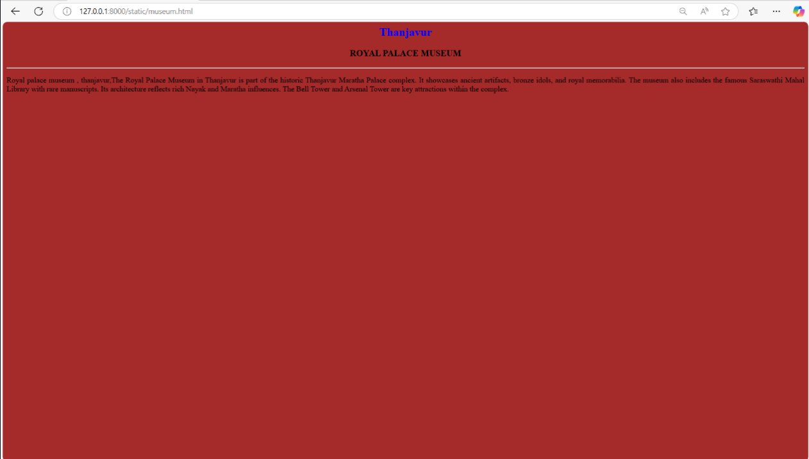
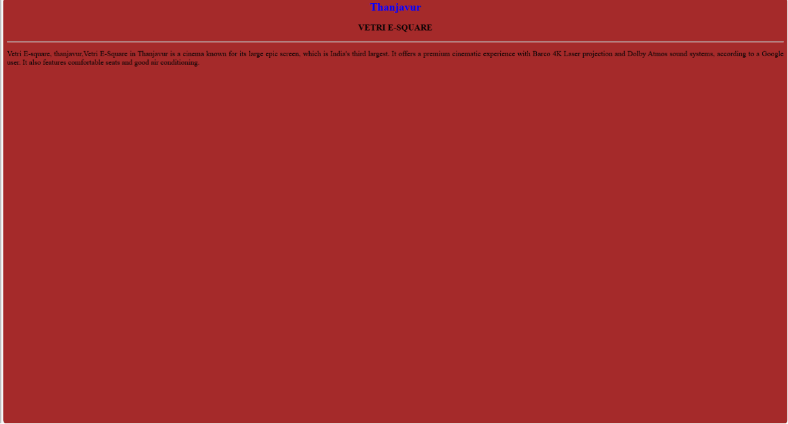
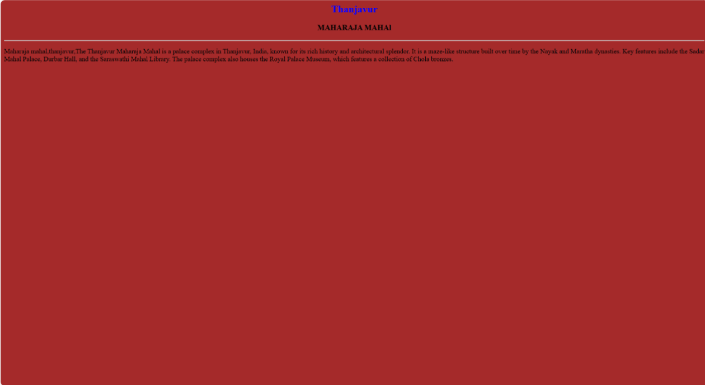
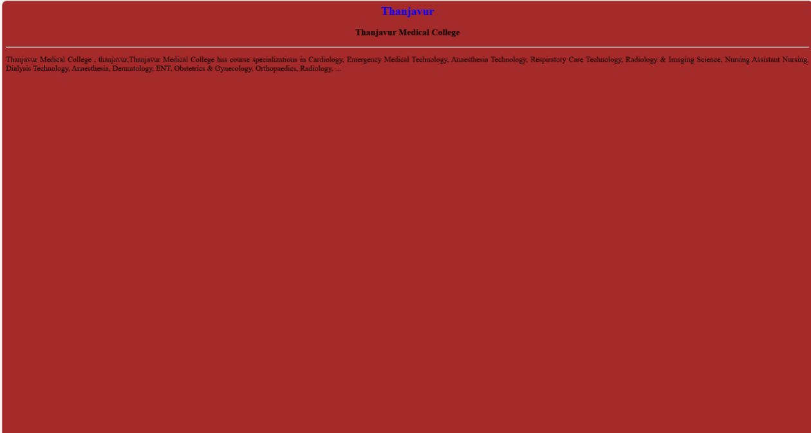

# Ex04 Places Around Me
## Date: 01.11.25

## AIM
To develop a website to display details about the places around my house.

## DESIGN STEPS

### STEP 1
Create a Django admin interface.

### STEP 2
Download your city map from Google.

### STEP 3
Using ```<map>``` tag name the map.

### STEP 4
Create clickable regions in the image using ```<area>``` tag.

### STEP 5
Write HTML programs for all the regions identified.

### STEP 6
Execute the programs and publish them.

## CODE
```
map.html
<html>
<head>
<title>My City</title>
</head>
<body>
<h1 align="center">
<font color="red"><b>THANJAVUR</b></font>
</h1>
<h3 align="center">
<font color="blue"><b>E.PAVITHRA(24010962)</b></font>
</h3>
<center>

<map name="MyCity">
                <area target="" alt="national hospital research centre" title="national hospital research centre"
                    href="hospital.html" coords="801,224,964,266" shape="rect">
                <area target="" alt="vetri E-square" title="vetri E-square" href="cinema.html" coords="426,645,562,689"
                    shape="rect">
                <area target="" alt="maharaja mahal" title="maharaja mahal" href="mahal.html" coords="413,748,546,786"
                    shape="rect">
                <area target="" alt="thanjavur medical college" title="thanjavur medical college" href="college.html"
                    coords="506,586,647,625" shape="rect">
                <area target="" alt="royal palace museum" title="royal palace museum" href="museum.html"
                    coords="626,302,792,337" shape="rect">
</map>
</center>
</body>
</html>

cinema.html
<html>

<BODY bgcolor="brown">
    <h2 align="center">
        <font color="BLUE">Thanjavur
    </h2>
    </FONT>
    <H3 align="center">VETRI E-SQUARE</H3>
    <HR>
    <p align="justify">Vetri E-square, thanjavur,Vetri E-Square in Thanjavur is a cinema known for its large epic
        screen, which is India's third largest. It offers a premium cinematic experience with Barco 4K Laser projection
        and Dolby Atmos sound systems, according to a Google user. It also features comfortable seats and good air
        conditioning. </p>
</BODY>

</html>

college.html
<html>

<BODY bgcolor="brown">
    <h2 align="center">
        <font color="BLUE">Thanjavur
    </h2>
    </FONT>
    <H3 align="center">Thanjavur Medical College</H3>
    <HR>
    <p align="justify">Thanjavur Medical College , thanjavur,Thanjavur Medical College has course specializations in
        Cardiology, Emergency Medical Technology, Anaesthesia Technology, Respiratory Care Technology, Radiology &
        Imaging Science, Nursing Assistant Nursing, Dialysis Technology, Anaesthesia, Dermatology, ENT, Obstetrics &
        Gynecology, Orthopaedics, Radiology, ...</p>
</BODY>

</html>

hospital.html
<html>

<BODY bgcolor="brown">
    <h2 align="center">
        <font color="BLUE">Thanjavur
    </h2>
    </FONT>
    <H3 align="center">NATIONAL MEDICAL RESEARCH COLLEGE</H3>
    <HR>
    <p align="justify">National medical research college,thanjavur,Indian Council of Medical Research - National
        Institute of Epidemiology aka ICMR-NIE is a health research organisation based out of 3rd Avenue, Tamil Nadu
        Housing Board, Ayapakkam, Ambattur, Chennai, Tamil Nadu, India.</p>
</BODY>

</html>

mahal.html
<html>

<BODY bgcolor="brown">
    <h2 align="center">
        <font color="BLUE">Thanjavur
    </h2>
    </FONT>
    <H3 align="center">MAHARAJA MAHAl</H3>
    <HR>
    <p align="justify">Maharaja mahal,thanjavur,The Thanjavur Maharaja Mahal is a palace complex in Thanjavur, India,
        known for its rich history and architectural splendor. It is a maze-like structure built over time by the Nayak
        and Maratha dynasties. Key features include the Sadar Mahal Palace, Durbar Hall, and the Saraswathi Mahal
        Library. The palace complex also houses the Royal Palace Museum, which features a collection of Chola bronzes.
    </p>
</BODY>

</html>

museum.html
<html>

<BODY bgcolor="brown">
    <h2 align="center">
        <font color="BLUE">Thanjavur
    </h2>
    </FONT>
    <H3 align="center">ROYAL PALACE MUSEUM</H3>
    <HR>
    <p align="justify">Royal palace museum , thanjavur,The Royal Palace Museum in Thanjavur is part of the historic
        Thanjavur Maratha Palace complex. It showcases ancient artifacts, bronze idols, and royal memorabilia. The
        museum also includes the famous Saraswathi Mahal Library with rare manuscripts. Its architecture reflects rich
        Nayak and Maratha influences. The Bell Tower and Arsenal Tower are key attractions within the complex.</p>
</BODY>

</html>
```

## OUTPUT








## RESULT
The program for implementing image maps using HTML is executed successfully.
